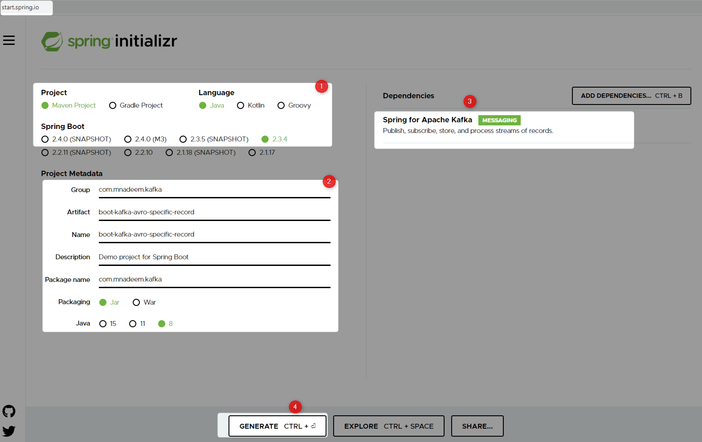

# Spring Boot Kafka Avro Specific Record example

## Prerequisites

Start the Local [Kafka Cluster](https://reachmnadeem.wordpress.com/category/cloud/kafka/)

```Powershell
E:\practices\docker\local-kafka-cluster>docker-compose up -d
Starting zookeeper       ... done 
Starting broker0         ... done
Starting broker2         ... done                                                                                                                                                               Starting broker1         ... done
Starting schema-registry ... done  
```
Cluster running

```Powershell
E:\practices\docker\local-kafka-cluster>docker ps
CONTAINER ID        IMAGE                                   COMMAND                  CREATED             STATUS              PORTS                                        NAMES
f77057aacf60        confluentinc/cp-schema-registry:5.5.1   "/etc/confluent/dock…"   5 days ago          Up 34 seconds       0.0.0.0:8081->8081/tcp                       schema-registry
33f99a3dcb08        confluentinc/cp-kafka:5.5.1             "/etc/confluent/dock…"   5 days ago          Up 34 seconds       9092/tcp, 0.0.0.0:9093->9093/tcp             broker1
066f1a099f75        confluentinc/cp-kafka:5.5.1             "/etc/confluent/dock…"   5 days ago          Up 34 seconds       9092/tcp, 0.0.0.0:9094->9094/tcp             broker2
fa3d3b370522        confluentinc/cp-kafka:5.5.1             "/etc/confluent/dock…"   5 days ago          Up 14 seconds       0.0.0.0:9092->9092/tcp                       broker0
eed01f313c32        confluentinc/cp-zookeeper:5.5.1         "/etc/confluent/dock…"   5 days ago          Up 35 seconds       2888/tcp, 0.0.0.0:2181->2181/tcp, 3888/tcp   zookeeper
```

## Create The Project




### Update the pom
Add the following dependencies

```xml
<dependency>
	<groupId>org.apache.avro</groupId>
	<artifactId>avro</artifactId>
	<version>${avro.version}</version>
</dependency>
<dependency>
	<groupId>io.confluent</groupId>
	<artifactId>kafka-avro-serializer</artifactId>
	<version>${confluent.version}</version>			
</dependency>

```
Here are the versions

```properties
<avro.version>1.9.2</avro.version>
<confluent.version>5.5.0</confluent.version>

```
Add avro maven plugin

```Powershell
<plugin>
	<groupId>org.apache.avro</groupId>
	<artifactId>avro-maven-plugin</artifactId>
	<version>${avro.version}</version>
	<executions>
		<execution>
			<phase>generate-sources</phase>
			<goals>
				<goal>schema</goal>
			</goals>
			<configuration>
				<sourceDirectory>${project.basedir}/src/main/avro/</sourceDirectory>
				<outputDirectory>${project.basedir}/target/generated-sources/avro/</outputDirectory>
				<!-- <outputDirectory>${project.basedir}/src/main/java/</outputDirectory> -->
			</configuration>
		</execution>
	</executions>
</plugin>
```
### Create Avro File
Create it under `src/main/avro`

```avro
{
  "namespace": "io.confluent.developer",
  "type": "record",
  "name": "User",
  "fields": [
    {
      "name": "name",
      "type": "string",
      "avro.java.string": "String"
    },
    {
      "name": "age",
      "type": "int"
    }
  ]
}
```

`KafkaConfig` Class

```java
import org.apache.kafka.clients.admin.NewTopic;
import org.springframework.beans.factory.annotation.Value;
import org.springframework.context.annotation.Bean;
import org.springframework.context.annotation.Configuration;
import org.springframework.kafka.config.TopicBuilder;

@Configuration
public class KafkaConfig {

	@Value("${kafka.topic.users}")
	private String userTopic;

	@Bean
	public NewTopic buildHscTopic() {
		return TopicBuilder.name(userTopic).build();
	}
	
}

```

```java
import org.slf4j.Logger;
import org.slf4j.LoggerFactory;
import org.springframework.beans.factory.annotation.Autowired;
import org.springframework.beans.factory.annotation.Value;
import org.springframework.kafka.core.KafkaTemplate;
import org.springframework.stereotype.Service;

import io.confluent.developer.User;

@Service
public class KafkaProducer {
	
	private static final Logger LOGGER = LoggerFactory.getLogger(KafkaConsumer.class);

	@Value("${kafka.topic.users}")
	private String topic;
	
	@Autowired
	private KafkaTemplate<String, User> kafkaTemplate;

	public void sendMessage(User user) {
		this.kafkaTemplate.send(this.topic, user.getName().toString(), user);
		LOGGER.info(String.format("Produced user -> %s", user));
	}
}
```
`KafkaConsumer` class

```java
import org.slf4j.Logger;
import org.slf4j.LoggerFactory;
import org.springframework.kafka.annotation.KafkaListener;
import org.springframework.kafka.support.Acknowledgment;
import org.springframework.stereotype.Service;

import io.confluent.developer.User;

@Service
public class KafkaConsumer {
	
	private static final Logger LOGGER = LoggerFactory.getLogger(KafkaConsumer.class);

	@KafkaListener(topics = "#{'${kafka.topic.users}'}", groupId = "#{'${spring.kafka.consumer.group-id}'}")
	public void consume(User record, Acknowledgment acknowledgment) {
		LOGGER.info(String.format("Consumed message -> %s", record));
		acknowledgment.acknowledge();
	}
}

```

#### Consume From beginning

```java
	@KafkaListener(topicPartitions = @TopicPartition(topic = "#{'${kafka.topic.users}'}", partitionOffsets = {
			@PartitionOffset(partition = "0", initialOffset = "0") }), groupId = "#{'${spring.kafka.consumer.group-id}'}", containerFactory = "kafkaListenerContainerFactory")
	public void consumeFromBegining(User record, @Header(KafkaHeaders.RECEIVED_PARTITION_ID) int partition, Acknowledgment acknowledgment) {
		System.out.println(
				" all msg Received Messasge in group 'foo': " + record + "RECEIVED_PARTITION_ID - " + partition);
		acknowledgment.acknowledge();

	}

```

#### Generic Record

Make sure `spring.kafka.properties.specific.avro.reader=false` is set to **false** and Avro _name space_ (Default package wont work) and _name_ is same

```java
@KafkaListener(topicPartitions = @TopicPartition(topic = "#{'${kafka.topic.users}'}", partitionOffsets = {
			@PartitionOffset(partition = "0", initialOffset = "0") }), groupId = "#{'${spring.kafka.consumer.group-id}'}", containerFactory = "kafkaListenerContainerFactory")
	public void listenAllMsg(ConsumerRecord<String, User> record, @Header(KafkaHeaders.RECEIVED_PARTITION_ID) int partition, Acknowledgment acknowledgment) {
		
		LOGGER.info(" Msg : {} RECEIVED_PARTITION_ID - {} ", record.value() , partition);

		acknowledgment.acknowledge();

	}

```

`BootKafkaAvroApplication` Class

```java
import org.springframework.beans.factory.annotation.Autowired;
import org.springframework.boot.CommandLineRunner;
import org.springframework.boot.SpringApplication;
import org.springframework.boot.autoconfigure.SpringBootApplication;

import com.mnadeem.kafka.messaging.KafkaProducer;

import io.confluent.developer.User;

@SpringBootApplication
public class BootKafkaAvroApplication implements CommandLineRunner {
	
	@Autowired
	private KafkaProducer producer;
	
	public static void main(String[] args) {
		SpringApplication.run(BootKafkaAvroApplication.class, args);
	}

	@Override
	public void run(String... args) throws Exception {
		producer.sendMessage(new User("Nadeem", 1));		
	}
}
```
Console output

```Powershell
020-10-10 11:43:07.490  INFO 7204 --- [           main] c.mnadeem.kafka.messaging.KafkaConsumer  : Produced user -> {"name": "Nadeem", "age": 1}
2020-10-10 11:43:09.921  INFO 7204 --- [ntainer#0-0-C-1] o.a.k.c.c.internals.ConsumerCoordinator  : [Consumer clientId=consumer-group_id-1, groupId=group_id] Finished assignment for group at generation 1: {consumer-group_id-1-8b65d7a6-dfa9-4835-b931-1140ad9a754b=Assignment(partitions=[users-0])}
2020-10-10 11:43:09.969  INFO 7204 --- [ntainer#0-0-C-1] o.a.k.c.c.internals.AbstractCoordinator  : [Consumer clientId=consumer-group_id-1, groupId=group_id] Successfully joined group with generation 1
2020-10-10 11:43:09.973  INFO 7204 --- [ntainer#0-0-C-1] o.a.k.c.c.internals.ConsumerCoordinator  : [Consumer clientId=consumer-group_id-1, groupId=group_id] Adding newly assigned partitions: users-0
2020-10-10 11:43:09.985  INFO 7204 --- [ntainer#0-0-C-1] o.a.k.c.c.internals.ConsumerCoordinator  : [Consumer clientId=consumer-group_id-1, groupId=group_id] Found no committed offset for partition users-0
2020-10-10 11:43:10.003  INFO 7204 --- [ntainer#0-0-C-1] o.a.k.c.c.internals.SubscriptionState    : [Consumer clientId=consumer-group_id-1, groupId=group_id] Resetting offset for partition users-0 to offset 0.
2020-10-10 11:43:10.004  INFO 7204 --- [ntainer#0-0-C-1] o.s.k.l.KafkaMessageListenerContainer    : group_id: partitions assigned: [users-0]
2020-10-10 11:43:10.087  INFO 7204 --- [ntainer#0-0-C-1] c.mnadeem.kafka.messaging.KafkaConsumer  : Consumed message -> {"name": "Nadeem", "age": 1}
```

## Testing Using Console

Connect to Schema Registry docker container

```Powershell
E:\practices\docker\local-kafka-cluster>docker exec -it schema-registry bash
root@schema-registry:/#

```


```Powershell
root@schema-registry:/usr/bin# ls kafka*
kafka-api-start  
kafka-avro-console-consumer  
kafka-avro-console-producer  
kafka-json-schema-console-consumer  
kafka-json-schema-console-producer  
kafka-protobuf-console-consumer  
kafka-protobuf-console-producer
root@schema-registry:/usr/bin# 
```


```Powershell
kafka-avro-console-consumer --bootstrap-server 172.18.0.3:9092,172.18.0.4:9093,172.18.0.5:9094 --property schema.registry.url=http://localhost:8081  --key-deserializer org.apache.kafka.common.serialization.StringDeserializer --value-deserializer io.confluent.kafka.serializers.KafkaAvroDeserializer  --property print.key=true  --max-messages 2 --from-beginning --topic users
```

```Powershell
E:\practices\docker\local-kafka-cluster>curl http://localhost:8081/subjects
["users-value"]

```

```Powershell
E:\practices\docker\local-kafka-cluster>curl http://localhost:8081/subjects/users-value/versions/latest
{"subject":"users-value","version":1,"id":1,"schema":"{\"type\":\"record\",\"name\":\"User\",\"namespace\":\"io.confluent.developer\",\"fields\":[{\"name\":\"name\",\"type\":\"string\",\"avro.java.string\":\"String\"},{\"name\":\"age\",\"type\":\"int\"}]}"} 
```

# Also See
* [Spring Integration Application Properties](https://docs.spring.io/spring-boot/docs/current/reference/html/appendix-application-properties.html#integration-properties)
* [Kafka Producer Configurations](https://kafka.apache.org/documentation/#producerconfigs)
* [Kafka Consumer Configurations](https://kafka.apache.org/documentation/#consumerconfigs)
* [Spring Boot Kafka](https://reflectoring.io/spring-boot-kafka/)
* [Schema Registry](https://docs.confluent.io/current/schema-registry/connect.html)


